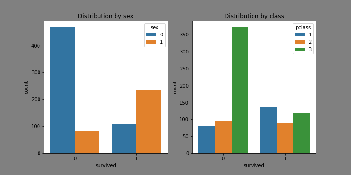

<h3 align="center">
    
     
</h3>

# Titanic-Model
- [Purpose](#purpose)
- [Tools applied](#tools)
- [Dataset description](#dataset)
- [Data cleaning](#cleaning)
- [Exploratory data analysis](#exploratory)
    - [Distribution of survival rate](#survival_dist) 

## Purpose
The purpose of this project is to perfom some statistical analysis using python about the [Titanic data set](https://www.kaggle.com/c/titanic/data) found on kaggle and draw some initial inferences about the characteristics of the passengers and their probability of survival based on these characterisitcs. Furthermore, a ML model will be trained with the most important features to predict the survival outcome of the passengers. 

See the complete code [Notebook](titanic_analysis.ipynb)

## Tools applied
- Python
- Pandas
- Seaborn
- Matplotlib
- sklearn

## Dataset description
From the inital description of the data we can see that we have 891 datapoints at our disposal, and 12 attributes:
- A unique passenger ID, stored as an integer
- A binary variable indicating if the passenger survived the sinking (This is the ultimate variable we will try to predict)
- The class of the ticker of the passenger, stored as an integer (i.e 1: First class, 2: Second class...)
- The name of the passenger stored as a string
- The sex of the passenger stored as a string
- The number of sieblings or spouses that the passenger had on board, stored as an integer
- The age of the passenger stored as a float
- The number of parents or children the passenger had on board, stored as a integer
- The ticket number
- The price of the ticker stored as a float
- The cabin number
- The port of embarcation

## Data cleaning
### Missing values 
A total of 3 columns contained missing values:
- Sex: was filled with the average age of the respective sex
- Cabin and embarked were dropped from the set

### Non-numeric attributes
Extracting information from name attribute
The raw data contains the attribute of name, which is composed by last name, title. First name Second Name. In order to extract the most information out of this attribute we will decompose it into its' individual parts and create new attributes:
- First name
- Middle name
- Last name
- Title

To do this we have to eliminate the parenthesis but not the content between it and then split the text into the components mentioned

Two Non-numeric attributes were connverted into numeric:
- Sex: was converted in a dicotomic variable with 0 for men and 1 for women
- Title: the title feature was extracted from the name attribute and converted into a numeric scale

## Explotatory data analysis
For this section we will take a general look of the variables we have at our disposal, to asess how relevant they can be for the model

### Distribution of survival rate
From the figures below, we can see that the survival rate is of only 38.39%, meaning that most of the passenger could not survive the accident.

During the Titanic sinking, the strategy was to board women and children first in the lifeboats.

From the first graph, we can conclude that, of the passengers who survived, most of them were women, and on the other hand, most of the non-survivers were men. 

From the second graph, it is easy to see the distribution of non-survivers with a clear skew towards to lowest classes, with 3rd class having more than 3 times the causalities that those of 1st and second class. 

<h3 align="left">
    
     
</h3>

